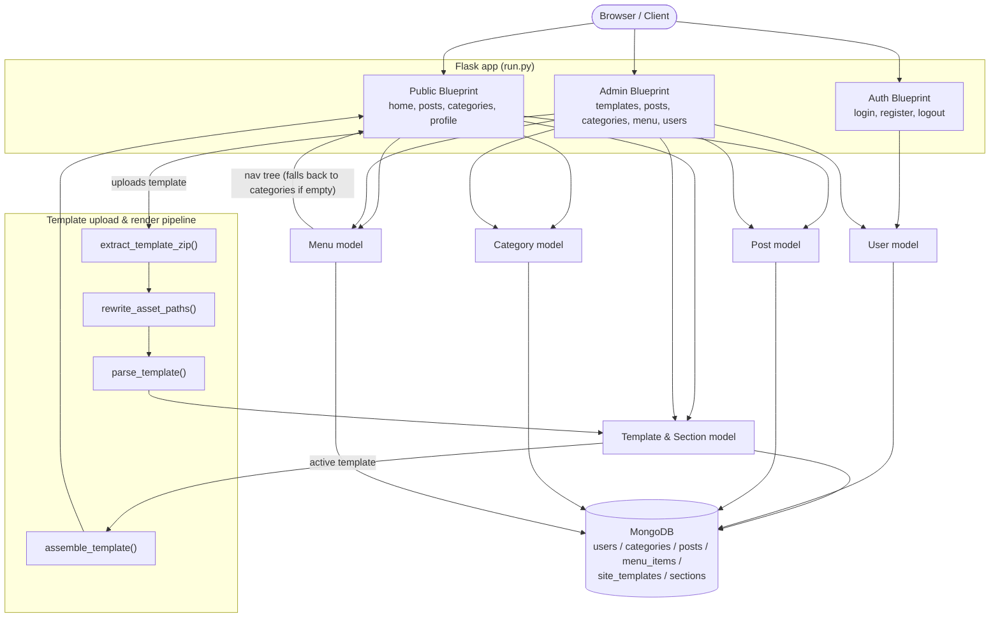
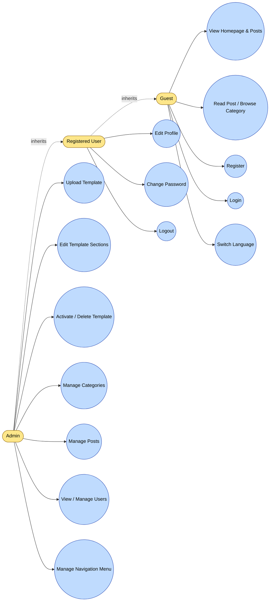

# myWeblogC — Visual Diagrams

Open this file in VS Code and press **Ctrl+Shift+V** (Markdown: Open Preview) to render the diagrams below.

Rendering requires the **Markdown Preview Mermaid Support** extension (`bierner.markdown-mermaid`). If it isn't installed yet, open the Extensions view (Ctrl+Shift+X), search for it, and click Install — or run `code --install-extension bierner.markdown-mermaid` from a terminal.

Each box/node below is clickable in the preview and opens the matching source file; hovering shows a tooltip with its responsibility. Click support depends on the Mermaid security settings used by the preview extension — if a click doesn't navigate in your setup, use the legend table under each diagram instead (same file paths).

---

## 1. Application Workflow

| Node | File | Responsibility |
|---|---|---|
| Public Blueprint | [app/routes/public/__init__.py](../app/routes/public/__init__.py) | Homepage, post detail, category listing, profile |
| Auth Blueprint | [app/routes/auth.py](../app/routes/auth.py) | Login, register, logout, language switch |
| Admin Blueprint | [app/routes/admin/__init__.py](../app/routes/admin/__init__.py) | Templates, sections, categories, posts, users |
| User model | [app/models/user.py](../app/models/user.py) | Account creation, auth checks, profile updates |
| Post model | [app/models/post.py](../app/models/post.py) | Post CRUD, slugs, publish state |
| Category model | [app/models/category.py](../app/models/category.py) | Category tree CRUD, slugs |
| Menu model | [app/models/menu.py](../app/models/menu.py) | Nav menu item CRUD, tree building, URL resolution |
| Template & Section model | [app/models/template.py](../app/models/template.py) | Template/section storage, activation, HTML assembly |
| extract_template_zip() | [app/utils/zip_template.py](../app/utils/zip_template.py) | Safe zip extraction (zip-slip guarded), finds entry HTML |
| rewrite_asset_paths() / parse_template() | [app/utils/template_parser.py](../app/utils/template_parser.py) | Fixes asset URLs, splits HTML into editable sections |

---

## 2. Data Model — MongoDB Collections & Relations

```mermaid
erDiagram
    USERS {
        ObjectId _id
        string username
        string email
        string password_hash
        string role "user or admin"
        object profile
        bool is_active
        datetime created_at
    }

    CATEGORIES {
        ObjectId _id
        string name_en
        string name_fa
        string slug
        ObjectId parent_id "self-reference"
        int order
        bool is_active
    }

    POSTS {
        ObjectId _id
        string title_en
        string title_fa
        string slug
        string content_en
        string content_fa
        ObjectId category_id
        ObjectId author_id
        bool is_published
        datetime created_at
    }

    MENU_ITEMS {
        ObjectId _id
        string title_en
        string title_fa
        string link_type "custom or category"
        ObjectId category_id "set when link_type=category"
        string url "set when link_type=custom"
        ObjectId parent_id "self-reference, one level"
        int order
        bool open_new_tab
        bool is_active
    }

    SITE_TEMPLATES {
        ObjectId _id
        string name
        string original_html
        string global_css
        string global_js
        string asset_folder "set when uploaded from .zip"
        bool is_active
        datetime created_at
    }

    SECTIONS {
        ObjectId _id
        ObjectId template_id
        string section_id
        string tag_name
        string content_en
        string content_fa
        string css_en
        string css_fa
        int order
    }

    USERS ||--o{ POSTS : "authors (author_id)"
    CATEGORIES ||--o{ POSTS : "categorizes (category_id)"
    CATEGORIES ||--o{ CATEGORIES : "parent of (parent_id)"
    CATEGORIES ||--o{ MENU_ITEMS : "linked by (category_id)"
    MENU_ITEMS ||--o{ MENU_ITEMS : "parent of (parent_id)"
    SITE_TEMPLATES ||--o{ SECTIONS : "contains (template_id)"

    click USERS "../app/models/user.py" "User accounts collection"
    click CATEGORIES "../app/models/category.py" "Category tree collection"
    click POSTS "../app/models/post.py" "Blog posts collection"
    click MENU_ITEMS "../app/models/menu.py" "Nav menu items collection"
    click SITE_TEMPLATES "../app/models/template.py" "Uploaded templates collection"
    click SECTIONS "../app/models/template.py" "Editable template sections collection"
```

| Collection | File | Responsibility |
|---|---|---|
| users | [app/models/user.py](../app/models/user.py) | Accounts, roles (user/admin), profile, password hash |
| categories | [app/models/category.py](../app/models/category.py) | Hierarchical post categories (self-referencing via parent_id) |
| posts | [app/models/post.py](../app/models/post.py) | Blog posts, linked to one category and one author |
| menu_items | [app/models/menu.py](../app/models/menu.py) | Nav bar entries (custom links or category links), self-referencing for one level of dropdowns |
| site_templates | [app/models/template.py](../app/models/template.py) | Uploaded site templates, one active at a time |
| sections | [app/models/template.py](../app/models/template.py) | Editable per-section HTML/CSS belonging to a template |

---

## 3. Use Case Diagram — Actors & Capabilities

| Use case | Actor | File | Handler |
|---|---|---|---|
| View Homepage & Posts | Guest | [app/routes/public/__init__.py](../app/routes/public/__init__.py) | `home()` |
| Read Post / Browse Category | Guest | [app/routes/public/__init__.py](../app/routes/public/__init__.py) | `post_detail()`, `category_posts()` |
| Register | Guest | [app/routes/auth.py](../app/routes/auth.py) | `register()` |
| Login | Guest | [app/routes/auth.py](../app/routes/auth.py) | `login()` |
| Switch Language | Guest | [app/routes/auth.py](../app/routes/auth.py) | `set_language()` |
| Edit Profile | Registered User | [app/routes/public/__init__.py](../app/routes/public/__init__.py) | `profile_update()` |
| Change Password | Registered User | [app/routes/public/__init__.py](../app/routes/public/__init__.py) | `change_password()` |
| Logout | Registered User | [app/routes/auth.py](../app/routes/auth.py) | `logout()` |
| Upload Template | Admin | [app/routes/admin/__init__.py](../app/routes/admin/__init__.py) | `template_upload()` |
| Edit Template Sections | Admin | [app/routes/admin/__init__.py](../app/routes/admin/__init__.py) | `section_edit()` |
| Activate / Delete Template | Admin | [app/routes/admin/__init__.py](../app/routes/admin/__init__.py) | `template_activate()`, `template_delete()` |
| Manage Categories | Admin | [app/routes/admin/__init__.py](../app/routes/admin/__init__.py) | `category_create()`, `category_edit()`, `category_delete()` |
| Manage Posts | Admin | [app/routes/admin/__init__.py](../app/routes/admin/__init__.py) | `post_create()`, `post_edit()`, `post_toggle_publish()` |
| View / Manage Users | Admin | [app/routes/admin/__init__.py](../app/routes/admin/__init__.py) | `user_list()` |
| Manage Navigation Menu | Admin | [app/routes/admin/__init__.py](../app/routes/admin/__init__.py) | `menu_create()`, `menu_edit()`, `menu_delete()` |
